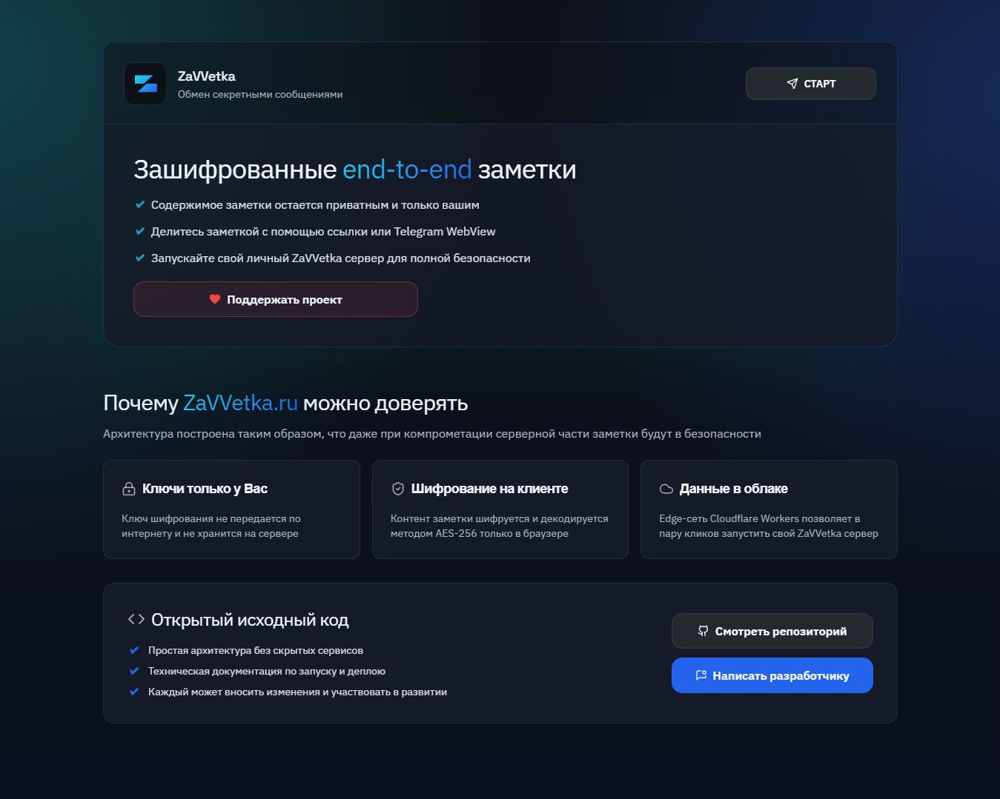
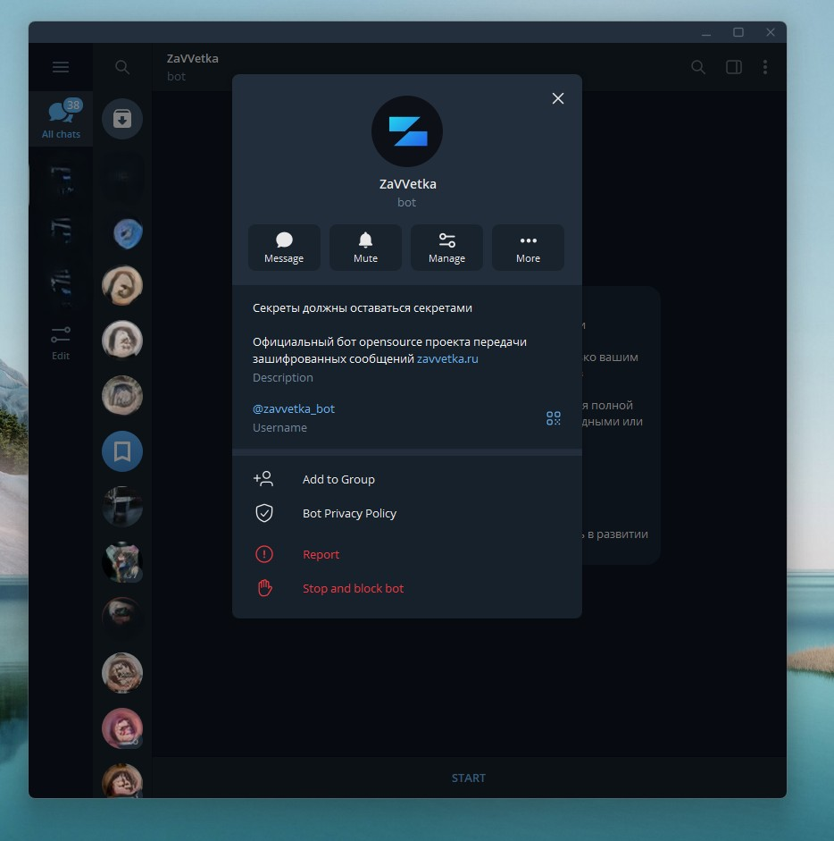

  

### Секреты должны оставаться секретами, верно?
ZaVVetka - Это OpenSource проект на github, а также одноименный telegram-бот для обмена зашифрованными заметками, с автоматическим удалением при прочтении или таймеру, с защитой от скриншотов и уведомлении при прочтении с отображением сетевых данных читателя.
Проект создан энтузиастами для сообщества, которое может вносить вклад в развитие с помощью спонсорства и контрибьюции кода проекта на github!

## Официальные ссылки проекта
- Сайт: [zavvetka.ru](https://zavvetka.ru)
- Telegram бот: [@zavvetka_bot](https://t.me/zavvetka_bot)
- GitHub: [falsepeter/zavvetka](https://github.com/falsepeter/zavvetka)

  

- [Лендинг zavvetka](landing-pages/README.md).
<!-- 

  

 -->
<!-- 
### Остерегайтесь недобросовестных клонов! -->

<!-- 
## Что реализовано

- [Страница лендинга бота](landing-pages/README.md).
- Кнопка Telegram `Создать заметку` (`/start` + reply keyboard).
- Сообщение от бота:
  - `Заметка от DD.MM.YY HH:MM создана`.
  - Полная ссылка вида `https://domain/UUID#md5`.
  - Кнопка `Редактировать` (Telegram `web_app`).
  - Переключатель автоудаления:
    - `5 мин`, `15 мин`, `30 мин`, `60 мин`, `24 часа`, `Удалить при первом прочтении`, `Без автоудаления`.
- Страница заметки:
  - минималистичный редактор текста (desktop + mobile),
  - AES-256-GCM шифрование/дешифрование на фронтенде,
  - автосохранение через 30 секунд после последнего ввода (debounce),
  - защита от параллельных сохранений,
  - статус последнего сохранения с секундами,
  - кнопка удаления,
  - таймер автоудаления.
- Уведомление создателю при каждом открытии:
  - `Заметка от ... только что была открыта с IP адреса: ...` -->

## Техническая документация

- [Архитектура и API основного Worker](docs/technical.md)
- [Запуск и деплой сервисов](docs/dev-deploy.md)
- [Документация лендинга](landing-pages/README.md)
- [Документация donations-worker](donations-worker/README.md)

<!-- ## Ограничения текущей версии

- Нет авторизации по пользователю на открытие/редактирование заметки -->

## Благодарность спонсорам zavvetka.ru

Telegram-бот работает молниеносно, безлимитно и без рекламы благодаря спонсорам проекта. 
Спасибо что вы есть! Я очень рад создавать и обслуживать качественные сервисы для Вас!

💙 [Поддержать обслуживание телеграм бота](https://zavvetka.ru/donate) 💙

  

